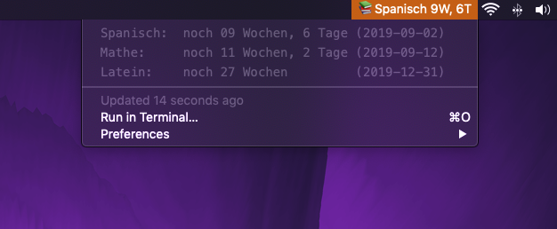

# BitBar Plugin - Klausuren/Ereignis Countdown

Dieses Python Script zeigt deine nächsten Termine/Klausuren mit Countdown in der Menubar an.
Der nächste Termin wird direkt in der Menubar gezeigt, der Status der anderen kann mit Hilfe eines Klicks auf das Plugin in der Menubar eingesehen werden.

### ❗️Features
- automatische Sortierung
- Zeigt nächsten Termin direkt in der Menubar an
- Zeit wird elegant in X Wochen, Y Tage angezeigt

## ⚙️ Install
1. Installiere [BitBar](https://github.com/matryer/bitbar)
2. Clone die Repository/lade sie herunter
3. Füge deine Klausuren/Termine in das Dictionary am Anfang des Scripts ein
4. Kopiere das Script in deinen BitBar-Plugins Ordner